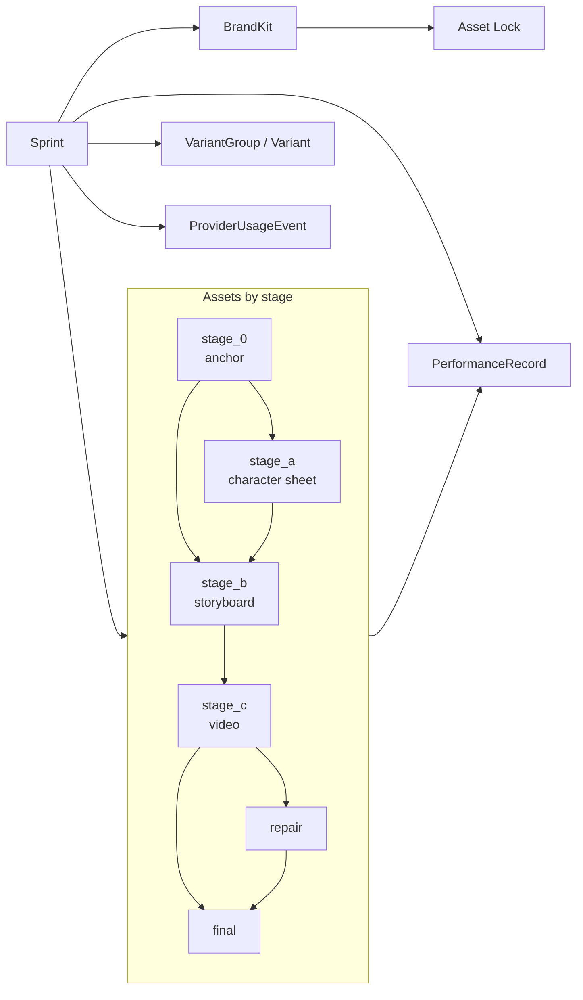
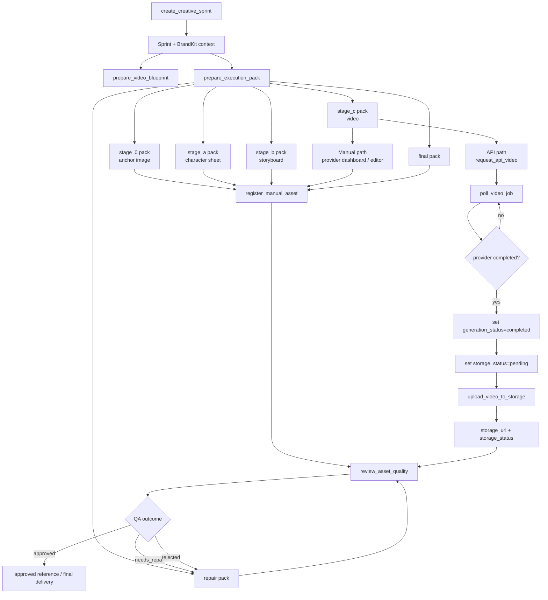
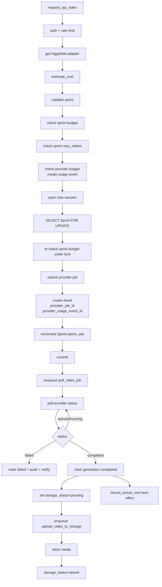
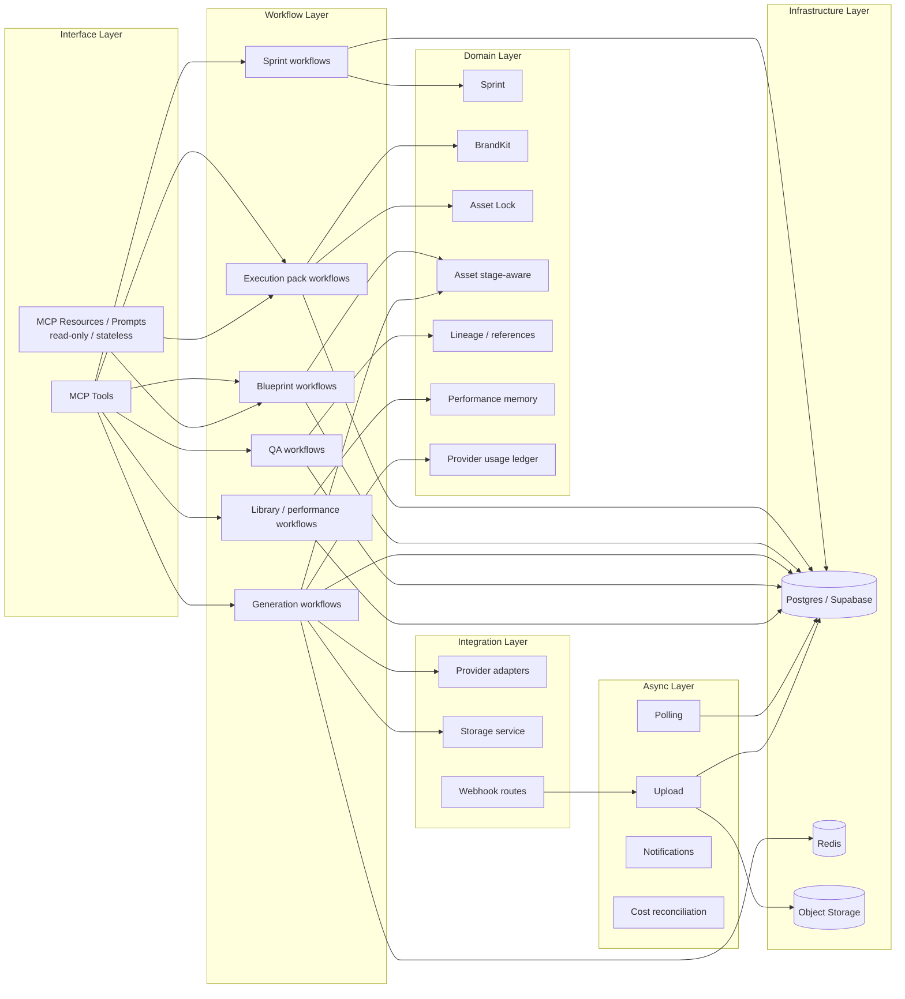

# Project Architecture

This document describes the current architecture of `vos-studio-mcp` after the VOS-native domain evolution work.

It focuses on:
- the main runtime layers,
- the stage-aware VOS domain,
- the generation and execution flows,
- and the relationship between MCP tools, workflows, providers, persistence, and async workers.

---

## 1. Architecture overview

The current architecture is organized as:
- a thin MCP interface layer,
- an application/workflow layer,
- a stronger VOS creative domain,
- provider and storage integration layers,
- asynchronous background workers,
- and Postgres/Redis/object storage as infrastructure.

In addition to tools, the server also exposes MCP-native resources and prompts. These are read-only, stateless knowledge artifacts and should be understood as a knowledge surface, not as part of the transactional workflow path.

```mermaid
flowchart TD
    A[MCP Clients<br/>ChatGPT / agents / operators]

    A --> B[MCP Server / Tool Surface<br/>create_creative_sprint<br/>prepare_execution_pack<br/>prepare_video_blueprint<br/>request_api_video<br/>register_manual_asset<br/>review_asset_quality<br/>library / status tools]

    B --> C[Application / Workflow Services<br/>sprint_service<br/>execution_pack_service<br/>blueprint_service<br/>generation_service<br/>asset_service<br/>prompt_library_service<br/>performance_record_service<br/>budget_guard<br/>audit_service]

    B --> R[MCP Resources / Prompts<br/>read-only, stateless<br/>vos://playbook<br/>vos://stage-templates/{stage}<br/>vos://providers<br/>vos_creative_brief<br/>vos_shot_direction]

    C --> D[VOS Creative Domain<br/>Sprint<br/>BrandKit + Asset Lock<br/>Asset<br/>VariantGroup / Variant<br/>PerformanceRecord<br/>ProviderUsageEvent]

    C --> E[Provider Adapters<br/>Higgsfield<br/>Freepik<br/>Magnific<br/>Manual Dashboard]

    C --> F[Control / Policy Layer<br/>auth guards<br/>tenant context + RLS<br/>rate limiter<br/>budget checks<br/>audit trail]

    C --> G[Async Tasks / Workers<br/>poll_video_job<br/>upload_video_to_storage<br/>upload_image_to_storage<br/>webhook follow-ups]

    D --> H[(Postgres / Supabase)]
    F --> H
    G --> H

    E --> I[External Providers<br/>video generation<br/>image generation<br/>upscaling<br/>manual dashboards]

    G --> J[Object Storage<br/>media URLs / previews]

    I --> G
```

### Scope note

The tool surface shown above is a high-level summary, not a complete tool inventory. The current server also exposes workflow and operations tools such as sprint status, provider usage summary, provider capability listing, client webhook configuration, variant conclusion, circuit breaker reset, creative brief preparation, and campaign angle generation.

---

## 2. Vocabulary conventions

To keep the business language and the implementation language aligned, this document uses the following conventions:

- **Business stage names**: Stage 0, Stage A, Stage B, Stage C, Repair, Final
- **Internal stage identifiers**: `stage_0`, `stage_a`, `stage_b`, `stage_c`, `repair`, `final`
- **Asset Lock**: the campaign visual system / constraint layer used by VOS; the persisted field name is `asset_lock`
- **Operating modes**: the exact internal mode names are `dashboard_manual` and `api_credits`
- **Delivery readiness**: business readiness for a downstream step or final handoff; distinct from provider completion and distinct from storage upload completion

In other words:
- provider completion does not always mean storage completion
- storage completion does not always mean delivery readiness
- the Final stage is a business-stage concept, not just a storage state

---

## 3. Core domain model

The most important architectural change is that the domain is now more explicitly VOS-native.

The system no longer treats assets as only generic outputs. Instead, assets can now carry stage, kind, lineage, reference approval, and final-delivery semantics.

Main domain concepts:
- `Sprint`
- `BrandKit`
- `Asset Lock`
- `Asset` with stage-aware metadata
- `VariantGroup` / `Variant`
- `PerformanceRecord`
- `ProviderUsageEvent`



### Domain notes

- `BrandKit` remains the main campaign identity record.
- `asset_lock` adds more explicit campaign visual constraints.
- `Asset` is now the central creative artifact record, not just a storage reference.
- The sprint remains the operational container for the campaign workflow.

---

## 4. Creative execution architecture

The VOS workflow is now much closer to the actual production method:
- open sprint,
- prepare blueprint,
- prepare stage-aware execution pack,
- create/register assets by stage,
- run QA,
- repair if needed,
- register final delivery.

The most important nuance is that Stage C can now follow two distinct execution paths:
- an API path, which creates a provider job and then relies on polling/upload,
- or a manual provider path, where a human operator creates the asset and registers it directly.



### Important note

`upload_image_to_storage` exists in the system, but it belongs to image-provider completion paths and webhook/media-routing flows. It is not part of the `request_api_video()` path, which is currently video-only and bound to Higgsfield.

---

## 5. API video generation flow

The API-driven generation path is the most operationally sensitive workflow in the system because it combines:
- authentication,
- rate limiting,
- provider budget checks,
- sprint budget enforcement,
- provider submission,
- asset creation,
- async polling,
- storage upload,
- and eventual reconciliation.



### Important note

The current architecture distinguishes between:
- provider job completion,
- storage upload progression,
- and final asset availability.

This is important because an asset can be generation-complete while still not fully available in final storage.

---

## 6. Layered view

The system can also be read as six layers.



---

## 7. Architectural summary

### What is strong now

- Thin MCP tool layer
- Real provider adapter abstraction
- Stronger stage-aware domain model
- Asset Lock support in BrandKit
- Async job polling and storage upload separation
- Budget and audit controls integrated into the workflow layer
- MCP resources/prompts for reusable knowledge artifacts

### What this architecture optimizes for

- operational control,
- repeatable creative execution,
- auditability,
- provider isolation,
- and alignment with the VOS production method.

### What still deserves ongoing review

- status aggregation semantics for batch job views,
- sprint budget truth vs actual billed cost semantics,
- and continued tightening of the generation workflow state machine as the system evolves.

---

## 8. Known nuances in the current `main`

This document is intended to describe the current runtime architecture accurately, but a few nuances are worth calling out explicitly:

- The individual job status path is storage-aware, but aggregated job views still deserve review so they do not sound more final than the underlying storage state.
- The API video path clearly re-checks sprint budget under row lock. Limit semantics around `max_videos` should continue to be reviewed alongside the request-time concurrency model.
- The current cost reconciliation path is operationally useful, but the semantics of “actual billed cost” vs “estimate confirmed” should continue to be made clearer over time.

These are not architecture-breakers, but they are the kinds of details that affect how precisely the workflow layer communicates system state.

---

## 9. Relationship to ADRs

This document is descriptive.

The normative architectural direction remains in the ADRs, especially:
- `docs/adr/0039-vos-native-domain-evolution-roadmap.md`
- `docs/adr/0037-*`
- `docs/adr/0038-*`

This file should be updated whenever the runtime architecture or domain model changes in a meaningful way.
