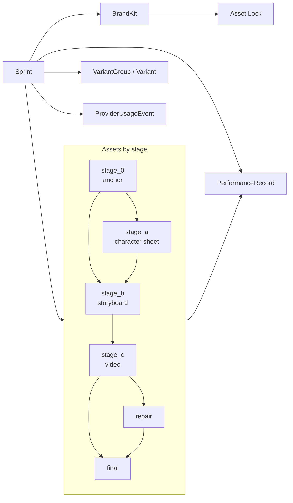
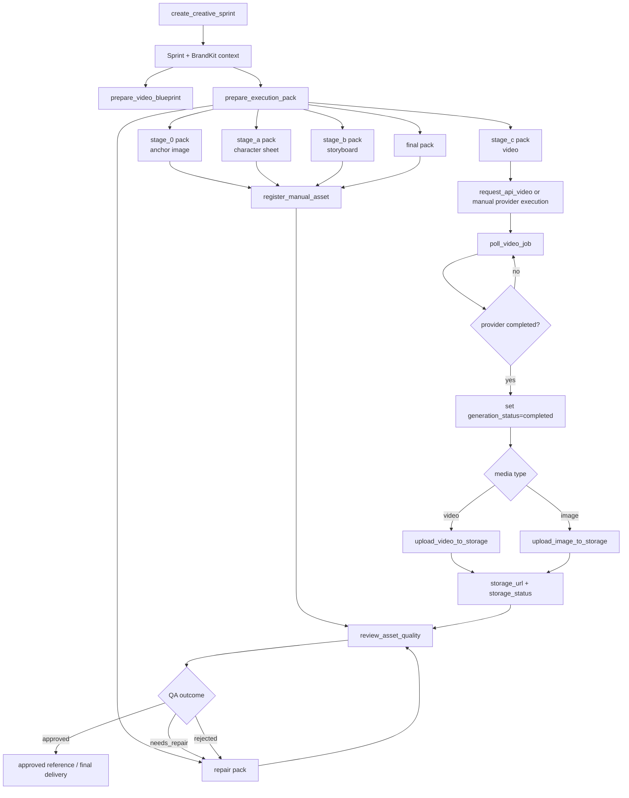
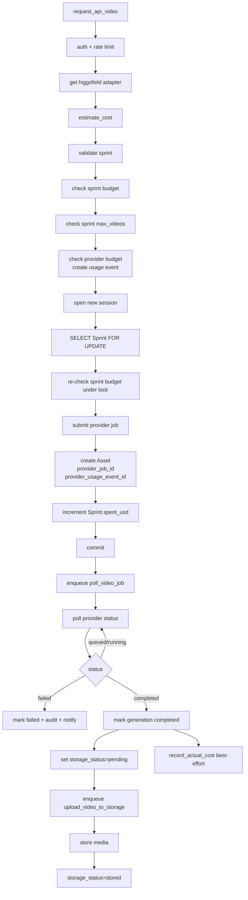
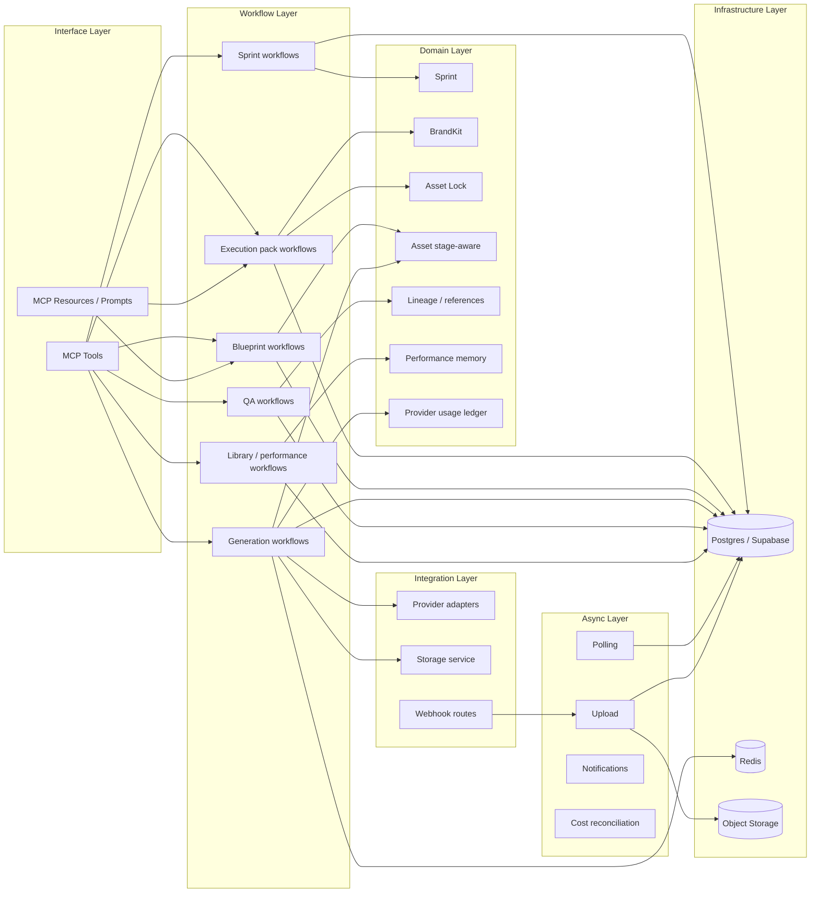

# Project Architecture

This document describes the current architecture of `vos-studio-mcp` after the VOS-native domain evolution work.

It focuses on:
- the main runtime layers,
- the stage-aware VOS domain,
- the generation and execution flows,
- and the relationship between MCP tools, workflows, providers, persistence, and async workers.

---

## 1. Architecture overview

The current architecture is organized as:
- a thin MCP interface layer,
- an application/workflow layer,
- a stronger VOS creative domain,
- provider and storage integration layers,
- asynchronous background workers,
- and Postgres/Redis/object storage as infrastructure.

```mermaid
flowchart TD
    A[MCP Clients<br/>ChatGPT / agents / operators]

    A --> B[MCP Server / Tool Surface<br/>create_creative_sprint<br/>prepare_execution_pack<br/>prepare_video_blueprint<br/>request_api_video<br/>register_manual_asset<br/>review_asset_quality<br/>library / status tools]

    B --> C[Application / Workflow Services<br/>sprint_service<br/>execution_pack_service<br/>blueprint_service<br/>generation_service<br/>asset_service<br/>prompt_library_service<br/>performance_record_service<br/>budget_guard<br/>audit_service]

    B --> R[MCP Resources / Prompts<br/>vos://playbook<br/>vos://stage-templates/{stage}<br/>vos://providers<br/>vos_creative_brief<br/>vos_shot_direction]

    C --> D[VOS Creative Domain<br/>Sprint<br/>BrandKit + Asset Lock<br/>Asset<br/>VariantGroup / Variant<br/>PerformanceRecord<br/>ProviderUsageEvent]

    C --> E[Provider Adapters<br/>Higgsfield<br/>Freepik<br/>Magnific<br/>Manual Dashboard]

    C --> F[Control / Policy Layer<br/>auth guards<br/>tenant context + RLS<br/>rate limiter<br/>budget checks<br/>audit trail]

    C --> G[Async Tasks / Workers<br/>poll_video_job<br/>upload_video_to_storage<br/>upload_image_to_storage<br/>webhook follow-ups]

    D --> H[(Postgres / Supabase)]
    F --> H
    G --> H

    E --> I[External Providers<br/>video generation<br/>image generation<br/>upscaling<br/>manual dashboards]

    G --> J[Object Storage<br/>media URLs / previews]

    I --> G
```

---

## 2. Core domain model

The most important architectural change is that the domain is now more explicitly VOS-native.

The system no longer treats assets as only generic outputs. Instead, assets can now carry stage, kind, lineage, reference approval, and final-delivery semantics.

Main domain concepts:
- `Sprint`
- `BrandKit`
- `Asset Lock`
- `Asset` with stage-aware metadata
- `VariantGroup` / `Variant`
- `PerformanceRecord`
- `ProviderUsageEvent`



### Domain notes

- `BrandKit` remains the main campaign identity record.
- `asset_lock` adds more explicit campaign visual constraints.
- `Asset` is now the central creative artifact record, not just a storage reference.
- The sprint remains the operational container for the campaign workflow.

---

## 3. Creative execution architecture

The VOS workflow is now much closer to the actual production method:
- open sprint,
- prepare blueprint,
- prepare stage-aware execution pack,
- create/register assets by stage,
- run QA,
- repair if needed,
- register final delivery.



---

## 4. API video generation flow

The API-driven generation path is the most operationally sensitive workflow in the system because it combines:
- authentication,
- rate limiting,
- provider budget checks,
- sprint budget enforcement,
- provider submission,
- asset creation,
- async polling,
- storage upload,
- and eventual reconciliation.



### Important note

The current architecture distinguishes between:
- provider job completion,
- storage upload progression,
- and final asset availability.

This is important because an asset can be generation-complete while still not fully available in final storage.

---

## 5. Layered view

The system can also be read as six layers.



---

## 6. Architectural summary

### What is strong now

- Thin MCP tool layer
- Real provider adapter abstraction
- Stronger stage-aware domain model
- Asset Lock support in BrandKit
- Async job polling and storage upload separation
- Budget and audit controls integrated into the workflow layer
- MCP resources/prompts for reusable knowledge artifacts

### What this architecture optimizes for

- operational control,
- repeatable creative execution,
- auditability,
- provider isolation,
- and alignment with the VOS production method.

### What still deserves ongoing review

- status aggregation semantics for batch job views,
- sprint budget truth vs actual billed cost semantics,
- and continued tightening of the generation workflow state machine as the system evolves.

---

## 7. Relationship to ADRs

This document is descriptive.

The normative architectural direction remains in the ADRs, especially:
- `docs/adr/0031-vos-native-domain-evolution-roadmap.md`
- `docs/adr/0037-*`
- `docs/adr/0038-*`

This file should be updated whenever the runtime architecture or domain model changes in a meaningful way.
